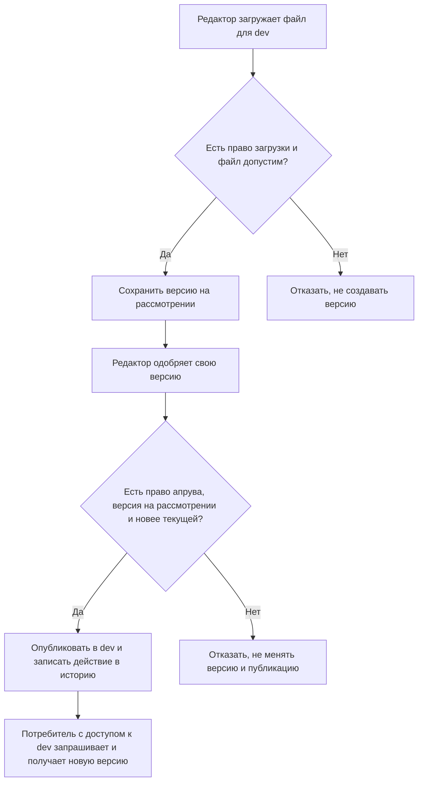
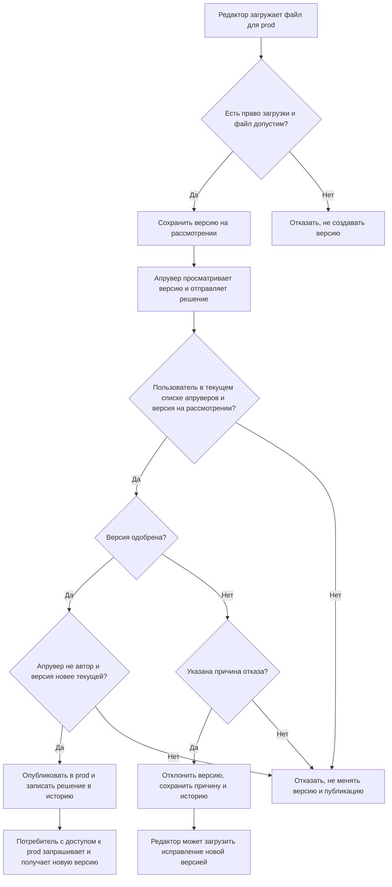
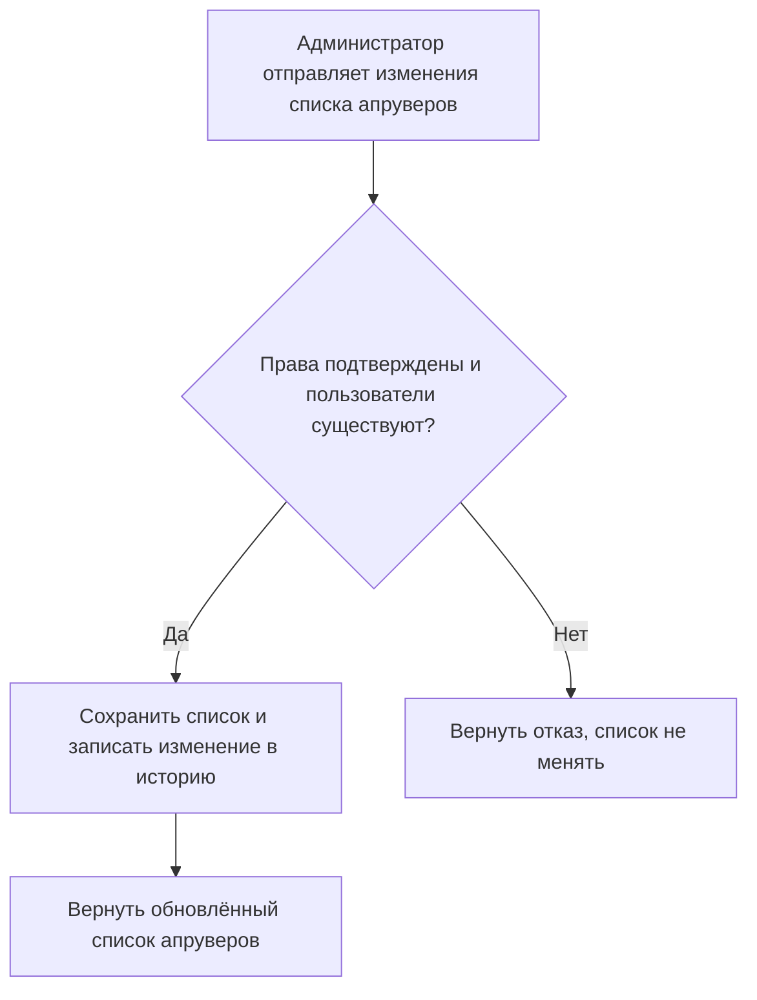
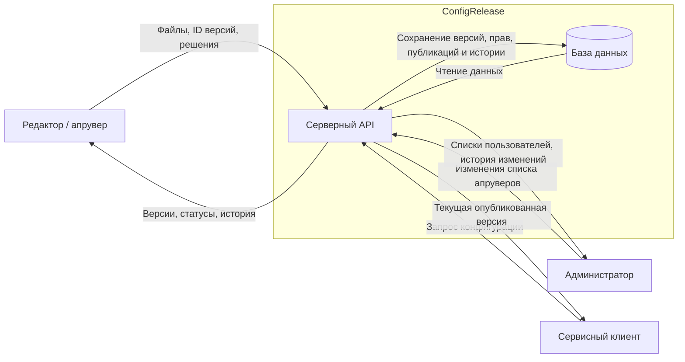

# Паспорт проекта

## Общие сведения

**Название команды:** БАН

**Название продукта:** ConfigRelease

**Коды участников:** `M1`, `M2`, `M3`

**Статус ранней калибровки:** `черновик`

За основу взяли тему №24 «Публикация конфигураций приложений» из банка идей курса. Конфигурации хранятся отдельно от приложений: один набор настроек могут использовать несколько сервисов. В `dev` редактор может выпустить настройки сам, а в `prod` их должен проверить другой пользователь.

### Термины

- **Конфигурация** — набор настроек с именем и ID. Для неё хранятся версии и права доступа.
- **Версия** — загруженный файл настроек с номером, автором и окружением. После сохранения эти данные нельзя менять.
- **Окружение** — место использования настроек: `dev` для разработки, `prod` для рабочей системы. Само хранилище при этом может работать на одном сервере.
- **Апрув** — одобрение версии. Сразу после него версия публикуется.
- **Текущая публикация** — версия, которую сервис сейчас выдаёт для выбранной конфигурации и окружения.
- **Потребитель** — внешнее приложение, которое получает настройки через API.

## 1. Назначение

ConfigRelease позволяет хранить версии конфигураций и выбирать, какие настройки выдавать для `dev` и `prod`. Редактор загружает файл и может сам одобрить его для `dev`; выпуск в `prod` требует проверки другим апрувером. Администратор меняет списки апруверов, а приложения получают текущие опубликованные настройки через API. Сервис следит за правами пользователей, состоянием версий и сохраняет историю загрузок, решений и публикаций.

## 2. Граница продукта

**В продукт входит:**

- HTTP API для загрузки, просмотра, одобрения и отклонения версий;
- проверка загружаемых файлов;
- вход пользователей и сервисных клиентов, проверка их прав;
- хранение конфигураций, версий, прав доступа и текущих публикаций;
- выдача опубликованных настроек потребителям;
- управление списками апруверов `prod`;
- история действий: кто, когда и что загрузил, одобрил, отклонил или изменил в списке апруверов.

**Внешнее окружение и внешние системы:**

- пользователи, обращающиеся к API;
- приложения, которые получают конфигурации;
- компьютер, на котором запускается сервер.

База данных входит в состав продукта. Клиенты работают с ней через API. Отдельное приложение-потребитель мы не разрабатываем: для демонстрации достаточно запросов к серверу. Внешние сервисы для работы хранилища не нужны.

**Команда сознательно не реализует:**

- веб-интерфейс, мобильный клиент и уведомления;
- регистрация, вход через сторонние сервисы и назначение администраторов через API;
- изменение уже загруженных файлов, слияние и наследование конфигураций;
- отложенный выпуск после апрува, отзыв с рассмотрения и откат;
- автоматическое применение настроек в приложении-потребителе.

Для демонстрации используем учебные настройки и учётные записи, без реальных секретов и персональных данных.

## 3. Пользователи и доступные действия

| Пользователь или роль | Кто это | Что может делать | Что ему недоступно |
| --- | --- | --- | --- |
| Редактор | Пользователь с доступом к определённой конфигурации | Читать её версии и историю, загружать файлы для обоих окружений, одобрять и отклонять версии в `dev`, в том числе свои | Работать с чужими конфигурациями, менять сохранённый файл, одобрять свою версию в `prod`, менять апруверов без роли администратора |
| Апрувер `prod` | Пользователь из списка апруверов конфигурации | Читать версии и историю `prod`, одобрять чужие версии или отклонять их с причиной | Одобрять свою версию, работать вне своих назначений, менять файлы и списки апруверов |
| Администратор | Пользователь, назначенный при настройке сервиса | Читать списки пользователей и апруверов, добавлять и удалять апруверов `prod`, смотреть историю этих изменений | Читать содержимое, загружать и публиковать версии без соответствующей роли; менять сохранённые версии, историю и администраторов через API |
| Сервисный клиент | Клиент с доступом к конкретной конфигурации и окружению | Получать текущую опубликованную версию | Читать неопубликованные версии, внутреннюю историю и чужие конфигурации; загружать файлы, принимать решения и менять права |
| Клиент без входа | Пользователь или приложение, не прошедшие аутентификацию | Проверять доступность сервера через `GET /health` | Читать конфигурации и выполнять остальные операции |

Один человек может иметь несколько ролей. Например, редактор может быть апрувером `prod`, но свою версию в этом окружении всё равно должен передать другому апруверу. Для администратора действует тот же запрет.

Пользователи, конфигурации, редакторы, доступ сервисных клиентов и первый администратор задаются начальными данными. Через API администратор меняет только списки апруверов `prod`. Он может добавить любого существующего пользователя, в том числе себя; это действие записывается в историю.

У одной конфигурации может быть несколько апруверов `prod`. Администратор может добавлять пользователей, удалять их или полностью менять состав списка. Добавление не требует удаления кого-то из прежних апруверов. Для публикации достаточно одобрения одного пользователя из текущего списка, если он не является автором версии.

После удаления из списка пользователь больше не может одобрять и отклонять версии `prod` этой конфигурации. Его прежние решения остаются в истории, выпущенные настройки продолжают действовать. Сервер проверяет права при каждой операции.

## 4. Сквозные сценарии

### Сценарий 1. Обновить настройки для разработки

- **Участники:** редактор и потребитель `dev`.
- **Начальное условие:** редактор имеет доступ к конфигурации, потребитель — к её опубликованным настройкам `dev`.
- **Основные действия:** редактор загружает файл для `dev`. Сервис проверяет его и сохраняет версию на рассмотрении. Редактор сам одобряет её, после чего потребитель запрашивает настройки.
- **Результат:** потребитель получает новую версию для `dev`.
- **Какие данные или состояние изменяются:** появляется версия с автором, после апрува она получает статус `published` и становится текущей для `dev`. Действия сохраняются в истории. Настройки `prod` остаются прежними.

### Сценарий 2. Выпустить настройки в рабочее окружение

- **Участники:** редактор, другой пользователь — апрувер `prod`, потребитель `prod`.
- **Начальное условие:** редактор может загрузить конфигурацию, а другой пользователь входит в список её апруверов `prod`.
- **Основные действия:** редактор загружает файл для `prod`. Апрувер просматривает сохранённую версию и одобряет её либо отклоняет с причиной.
- **Результат:** одобренная версия сразу публикуется и выдаётся потребителю. При отказе остаются прежние настройки; редактор видит причину и может загрузить исправленный файл как новую версию.
- **Какие данные или состояние изменяются:** сохраняются версия и решение апрувера. При одобрении обновляются статус, текущая публикация и история. Настройки `dev` не меняются.

### Сценарий 3. Изменить список апруверов

- **Участники:** администратор и пользователи, чьи права меняются.
- **Начальное условие:** конфигурация и пользователи уже созданы; нужно изменить, кто может рассматривать версии `prod`.
- **Основные действия:** администратор открывает список апруверов и добавляет или удаляет нужных пользователей. Он может расширить список, сократить его или полностью заменить состав.
- **Результат:** пользователи из обновлённого списка могут рассматривать версии `prod`, удалённые из него — больше не могут. Если апрувер является автором версии, одобрить её он не может.
- **Какие данные или состояние изменяются:** меняется список апруверов, действия администратора записываются в историю. Смена прав не меняет файлы, прежние решения и опубликованные настройки.

## 5. Значимые данные и другие объекты

| Данные или объект | Для кого имеют значение | Последствия раскрытия | Последствия неправильного изменения, удаления или недоступности |
| --- | --- | --- | --- |
| Содержимое версий | Редактор, апрувер, потребитель | Посторонний узнаёт внутренние настройки и планируемые изменения | Приложение получает неверные параметры; потерянную версию нельзя рассмотреть или выдать потребителю |
| Текущая публикация | Апрувер и потребитель | Становится известно, какая версия используется | Приложение получает чужие, старые или непроверенные настройки либо остаётся без конфигурации |
| Учётные данные и права доступа | Пользователи, администратор и сервисные клиенты | С чужими учётными данными можно действовать от имени владельца; списки назначений раскрывают права пользователей | Пользователь получает лишние права или теряет доступ; становится возможен выпуск в `prod` в обход проверки |
| Решения и история | Редактор, апрувер, администратор | Раскрываются действия пользователей и причины отказов | Нельзя установить, кто выпустил версию или сменил апруверов; записи не совпадают с текущим состоянием |

## 6. Компоненты и внешние взаимодействия

Продукт состоит из серверного API и базы данных. Сервер проверяет пользователя, его права и загруженные файлы, сохраняет изменения и выдаёт настройки.

Сервер определяет, кто отправил запрос, и проверяет его права. Одного имени пользователя или названия роли в запросе для этого недостаточно.

## 7. Откуда продукт получает данные

| Источник | Пример данных | Кто управляет источником | Как продукт использует данные |
| --- | --- | --- | --- |
| Загружаемый файл | YAML с настройками | Редактор | Проверяет файл и сохраняет новую версию |
| Параметры запроса | ID конфигурации, окружения и версии | Клиент | Находит нужную запись и проверяет право на действие |
| Решение по версии | Апрув или причина отказа | Редактор `dev` или апрувер `prod` | Публикует версию или сохраняет отклонение |
| Изменение списка апруверов | ID добавляемого или удаляемого пользователя | Администратор | Обновляет права и записывает действие в историю |
| Данные для входа | Учётные данные пользователя или сервисного клиента | Клиент | Определяет отправителя запроса и проверяет его права |
| Начальные данные и локальные настройки | Пользователи, конфигурации, редакторы, администратор, доступ потребителей | Команда | Подготавливает учебное окружение |
| Состояние в базе | Автор, статус, номер версии, текущая публикация | Сервер | Проверяет, разрешена ли операция, и формирует ответ |

## 8. Минимальное функциональное ядро

**Обязательные функции:**

- загрузка, проверка и просмотр YAML-конфигураций;
- апрув с немедленной публикацией и отклонение с причиной;
- самостоятельный апрув в `dev` и проверка другим пользователем в `prod`;
- получение текущих настроек сервисным клиентом;
- проверка прав для конфигурации, окружения и действия;
- добавление и удаление апруверов `prod` администратором;
- запись и просмотр истории в пределах прав пользователя.

**Функции, которые можно исключить при нехватке времени:**

- JSON как второй формат;
- сравнение версий;
- интерфейс и уведомления;
- создание конфигураций и назначение редакторов через API вместо начальных данных.

## 9. Стек и путь к первой работающей версии

**Основные технологии:** C#, .NET 10, ASP.NET Core Web API, SQLite, EF Core и YamlDotNet.

**Технологии, новые для команды:** —

**Внешние сервисы, необходимые для запуска:** не нужны. SDK и зависимости устанавливаются заранее или берутся из локального кеша.

**Как основные сценарии будут запускаться и проверяться при недоступности внешних сервисов:** локальный API и база с учебными данными. Проверки выполняются запросами от имени разных пользователей и сервисных клиентов. Для проверки доступа используются две конфигурации, оба окружения и несколько пользователей с разными правами.

**Что команда реализует первым, чтобы получить запускаемую версию:** серверный API с `GET /health` и инструкцией локального запуска.

## 10. Локальный запуск

**Требования к окружению:** .NET SDK 10.

**Команды установки и запуска:** —

**Команда или запрос для проверки:** `GET /health` локального сервера.

**Ожидаемый результат:** HTTP `200 OK` с сообщением о работе сервиса.
