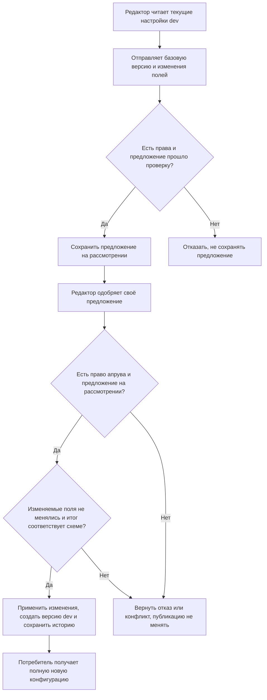
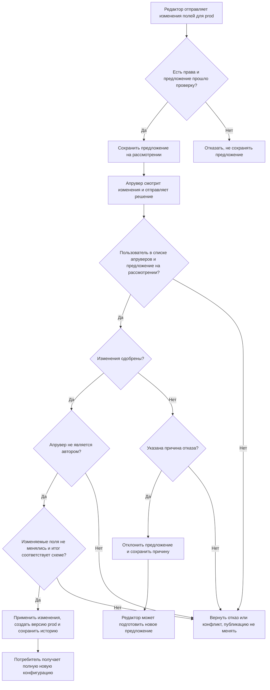
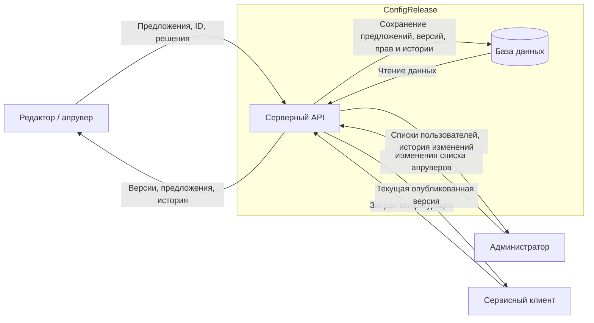

# Паспорт проекта

## Общие сведения

**Название команды:** БАН

**Название продукта:** ConfigRelease

**Коды участников:** `M1`, `M2`, `M3`

**Статус ранней калибровки:** `черновик`

За основу взяли тему №24 «Публикация конфигураций приложений» из банка идей курса. Конфигурации хранятся отдельно от приложений: один набор настроек могут использовать несколько сервисов. В `dev` редактор может выпустить настройки сам, а в `prod` их должен проверить другой пользователь.

### Термины

- **Конфигурация** — набор настроек с именем и ID. Для неё хранятся версии и права доступа.
- **Предложение изменений** — список полей, которые редактор хочет изменить, с прежними и новыми значениями. Имеет ID, автора, окружение и номер базовой версии. После отправки его нельзя редактировать.
- **Базовая версия** — опубликованная версия, которую редактор прочитал перед подготовкой изменений.
- **Версия** — полный сохранённый набор настроек после публикации. Номер назначает сервер при успешном апруве. Содержимое опубликованной версии неизменно.
- **Схема конфигурации** — описание допустимых полей, их типов и ограничений значений. Задаётся отдельно от предложений изменений.
- **Окружение** — место использования настроек: `dev` для разработки, `prod` для рабочей системы. Само хранилище при этом может работать на одном сервере.
- **Апрув** — одобрение предложения. Сервис сразу применяет изменения и публикует новую полную версию.
- **Текущая публикация** — версия, которую сервис сейчас выдаёт для выбранной конфигурации и окружения.
- **Потребитель** — внешнее приложение, которое получает настройки через API.

## 1. Назначение

ConfigRelease хранит конфигурации и позволяет менять отдельные настройки для `dev` и `prod`. Редактор отправляет предложение с прежними и новыми значениями полей; в `dev` он может одобрить его сам, а в `prod` нужна проверка другим апрувером. При апруве сервис проверяет конфликты, применяет изменения к текущим настройкам и сохраняет новую полную версию. Администратор управляет списками апруверов, приложения получают опубликованные настройки через API, а все изменения остаются в истории.

## 2. Граница продукта

**В продукт входит:**

- HTTP API для отправки, просмотра, одобрения и отклонения предложений изменений;
- проверка YAML, типов и значений по схеме конфигурации;
- проверка конфликтов при изменении полей и создание полной версии после апрува;
- вход пользователей и сервисных клиентов, проверка их прав;
- хранение конфигураций, предложений изменений, опубликованных версий, прав доступа и истории;
- выдача опубликованных настроек потребителям;
- управление списками апруверов `prod`;
- история действий: кто предложил изменения, какие поля изменились, кто принял решение или поменял список апруверов.

**Внешнее окружение и внешние системы:**

- пользователи, обращающиеся к API;
- приложения, которые получают конфигурации;
- компьютер, на котором запускается сервер.

База данных входит в состав продукта. Клиенты работают с ней через API. Отдельное приложение-потребитель мы не разрабатываем: для демонстрации достаточно запросов к серверу. Внешние сервисы для работы хранилища не нужны.

**Команда сознательно не реализует:**

- веб-интерфейс, мобильный клиент и уведомления;
- регистрация, вход через сторонние сервисы и назначение администраторов через API;
- создание и изменение схем конфигураций через API;
- редактирование отправленного предложения или опубликованной версии, наследование конфигураций;
- добавление и удаление полей, изменение вложенных объектов и элементов списков;
- автоматическое разрешение конфликтов в одном поле;
- отложенный выпуск после апрува, отзыв с рассмотрения и откат;
- автоматическое применение настроек в приложении-потребителе.

Для демонстрации используем учебные настройки и учётные записи, без реальных секретов и персональных данных.

## 3. Пользователи и доступные действия

| Пользователь или роль | Кто это | Что может делать | Что ему недоступно |
| --- | --- | --- | --- |
| Редактор | Пользователь с доступом к определённой конфигурации | Читать версии, предложения и историю; отправлять изменения для обоих окружений; одобрять и отклонять предложения в `dev`, в том числе свои | Работать с чужими конфигурациями, менять сохранённые предложения и версии, одобрять своё предложение в `prod`, менять апруверов без роли администратора |
| Апрувер `prod` | Пользователь из списка апруверов конфигурации | Читать версии, предложения и историю `prod`; одобрять чужие изменения или отклонять их с причиной | Одобрять своё предложение, работать вне своих назначений, менять содержимое предложений и списки апруверов |
| Администратор | Пользователь, назначенный при настройке сервиса | Читать списки пользователей и апруверов, добавлять и удалять апруверов `prod`, смотреть историю этих изменений | Читать настройки, отправлять и одобрять изменения без соответствующей роли; менять сохранённые версии, предложения, историю и администраторов через API |
| Сервисный клиент | Клиент с доступом к конкретной конфигурации и окружению | Получать текущую полную опубликованную версию | Читать предложения, внутреннюю историю и чужие конфигурации; отправлять изменения, принимать решения и менять права |
| Клиент без входа | Пользователь или приложение, не прошедшие аутентификацию | Проверять доступность сервера через `GET /health` | Читать конфигурации и выполнять остальные операции |

Один человек может иметь несколько ролей. Редактор может быть апрувером `prod`, но его предложение в этом окружении должен одобрить другой пользователь. Для администратора действует тот же запрет.

Пользователи, конфигурации, схемы, редакторы, доступ сервисных клиентов и первый администратор задаются начальными данными. Для каждой конфигурации в обоих окружениях есть исходная опубликованная версия, соответствующая схеме. Через API администратор меняет только списки апруверов `prod`.

У одной конфигурации может быть несколько апруверов `prod`. Администратор может расширять, сокращать или полностью менять список, добавляя существующих пользователей, в том числе себя. Для публикации достаточно одного апрува от пользователя из текущего списка, который не является автором предложения.

После удаления из списка пользователь больше не может одобрять и отклонять предложения `prod` этой конфигурации. Его прежние решения остаются в истории, выпущенные настройки продолжают действовать. Сервер проверяет права при каждой операции.

## 4. Сквозные сценарии

### Сценарий 1. Обновить настройки для разработки

- **Участники:** редактор и потребитель `dev`.
- **Начальное условие:** редактор имеет доступ к конфигурации, потребитель — к её настройкам `dev`.
- **Основные действия:** редактор читает текущую версию и отправляет изменения выбранных полей, указав базовую версию, старые и новые значения. Сервис проверяет предложение и сохраняет его на рассмотрении. Редактор сам одобряет его.
- **Результат:** при отсутствии конфликтов потребитель получает новую полную конфигурацию `dev`. Значения полей вне предложения берутся из текущей публикации и не затираются.
- **Какие данные или состояние изменяются:** сохраняется предложение; при апруве создаётся новая опубликованная версия, обновляется текущая публикация и записывается история. Настройки `prod` не меняются.



### Сценарий 2. Выпустить настройки в рабочее окружение

- **Участники:** редактор, другой пользователь — апрувер `prod`, потребитель `prod`.
- **Начальное условие:** редактор может предложить изменения конфигурации, другой пользователь входит в список её апруверов `prod`.
- **Основные действия:** редактор читает текущие настройки и отправляет предложение для `prod`. Апрувер смотрит, какие поля и значения меняются, и одобряет предложение либо отклоняет с причиной. Перед применением сервис повторно проверяет права, конфликты и всю итоговую конфигурацию.
- **Результат:** одобренные изменения сразу входят в новую опубликованную версию. При отклонении или конфликте текущие настройки сохраняются; редактор может подготовить новое предложение.
- **Какие данные или состояние изменяются:** сохраняются предложение и решение. При успешном апруве создаётся полная версия, обновляется текущая публикация и история. Настройки `dev` не меняются.



**Предложения и опубликованные версии**

Предложение получает ID при отправке и статус `in_review`. Его содержание, автор, конфигурация и окружение не меняются. Апрув переводит его в `applied` и создаёт полную опубликованную версию; отказ с причиной — в `rejected`. Повторно применить завершённое предложение нельзя. Номер версии назначается только при успешной публикации, отдельно для каждой пары «конфигурация + окружение», и растёт в порядке применения изменений.

При отправке сервер сверяет прежние значения с указанной базовой версией этой пары и проверяет новые значения по схеме. При апруве проверяет, что затронутые поля с тех пор не изменялись, затем применяет предложение к текущей конфигурации. Остальные поля остаются как в текущей публикации. После этого вся получившаяся конфигурация снова проверяется по схеме.

Два предложения по разным полям могут быть применены в любом порядке, если оба результата проходят проверку. Например, один редактор меняет `logLevel`, другой — `requestTimeoutSeconds`. Публикация первого не блокирует второе. Если оба меняют `logLevel`, после первого апрува второе получает конфликт. Все ожидающие предложения автоматически устаревшими не становятся.

Для проверки конфликта учитывается не только старое значение, но и последнее изменение поля: если оно изменилось и затем вернулось к прежнему значению, всё равно требуется новое предложение. Эти отметки хранит сервер; клиент передаёт номер базовой версии, из которой сервер получает исходное состояние полей.

При конфликте предложение остаётся на рассмотрении, текущая публикация не меняется. Редактор читает актуальные настройки и создаёт новое предложение; старое можно отклонить. Нельзя автоматически подменить базовую версию или старые значения в уже отправленном предложении.

Проверка конфликтов, применение всех полей предложения, присвоение номера версии, обновление текущей публикации и запись истории выполняются одной атомарной операцией. Если проверка не прошла или возник сбой, ни одно поле не публикуется. При одновременных апрувах проверяется состояние на момент применения, поэтому изменения одного поля не могут незаметно затереть друг друга.

### Сценарий 3. Изменить список апруверов

- **Участники:** администратор и пользователи, чьи права меняются.
- **Начальное условие:** конфигурация и пользователи уже созданы; нужно изменить, кто может рассматривать предложения `prod`.
- **Основные действия:** администратор открывает список апруверов и добавляет или удаляет нужных пользователей. Он может расширить список, сократить его или полностью заменить состав.
- **Результат:** пользователи из обновлённого списка могут рассматривать предложения `prod`, удалённые из него — больше не могут. Если апрувер является автором предложения, одобрить его он не может.
- **Какие данные или состояние изменяются:** меняется список апруверов, действия администратора записываются в историю. Смена прав не меняет предложения, прежние решения и опубликованные настройки.

```mermaid
flowchart TD
    Request["Администратор отправляет изменения списка апруверов"]
    Check{"Права подтверждены и пользователи существуют?"}
    Save["Сохранить список и записать изменение в историю"]
    Success["Вернуть обновлённый список апруверов"]
    Reject["Вернуть отказ, список не менять"]

    Request --> Check
    Check -->|"Да"| Save
    Save --> Success
    Check -->|"Нет"| Reject
```



## 5. Значимые данные и другие объекты

| Данные или объект | Для кого имеют значение | Последствия раскрытия | Последствия неправильного изменения, удаления или недоступности |
| --- | --- | --- | --- |
| Содержимое версий и предложений | Редактор, апрувер, потребитель | Посторонний узнаёт внутренние настройки и планируемые изменения | Приложение получает неверные параметры; потерянное предложение нельзя рассмотреть, а версию — выдать потребителю |
| Текущая публикация | Апрувер и потребитель | Становится известно, какая версия используется | Приложение получает чужие, старые или непроверенные настройки либо остаётся без конфигурации |
| Учётные данные и права доступа | Пользователи, администратор и сервисные клиенты | С чужими учётными данными можно действовать от имени владельца; списки назначений раскрывают права пользователей | Пользователь получает лишние права или теряет доступ; становится возможен выпуск в `prod` в обход проверки |
| Решения и история | Редактор, апрувер, администратор | Раскрываются действия пользователей и причины отказов | Нельзя установить, кто выпустил версию или сменил апруверов; записи не совпадают с текущим состоянием |

## 6. Компоненты и внешние взаимодействия

Продукт состоит из серверного API и базы данных. Сервер проверяет пользователя, его права и предложения изменений, создаёт полные версии и выдаёт настройки.



Сервер определяет, кто отправил запрос, и проверяет его права. Одного имени пользователя или названия роли в запросе для этого недостаточно.

## 7. Откуда продукт получает данные

| Источник | Пример данных | Кто управляет источником | Как продукт использует данные |
| --- | --- | --- | --- |
| Предложение изменений | YAML с базовой версией, старыми и новыми значениями | Редактор | Проверяет и сохраняет предложение на рассмотрении |
| Параметры запроса | ID конфигурации, окружения, предложения или версии | Клиент | Находит нужную запись и проверяет право на действие |
| Решение по предложению | Апрув или причина отказа | Редактор `dev` или апрувер `prod` | Применяет изменения и создаёт версию либо сохраняет отклонение |
| Изменение списка апруверов | ID добавляемого или удаляемого пользователя | Администратор | Обновляет права и записывает действие в историю |
| Данные для входа | Учётные данные пользователя или сервисного клиента | Клиент | Определяет отправителя запроса и проверяет его права |
| Начальные данные и локальные настройки | Пользователи, конфигурации, схемы, редакторы, администратор, доступ потребителей | Команда | Подготавливает учебное окружение |
| Состояние в базе | Автор и статус предложения, версии, отметки изменений полей | Сервер | Проверяет, разрешена ли операция, и формирует ответ |

### Формат и проверка конфигурации

Предложение передаётся как YAML в теле HTTP-запроса с `Content-Type: application/yaml`. Можно отправить текст напрямую или прочитать его из `.yaml`-файла. Потребитель получает полную опубликованную конфигурацию в YAML, без служебных полей предложения.

Пример предложения:

```yaml
baseVersion: 5
changes:
  logLevel:
    old: Information
    new: Debug
  requestTimeoutSeconds:
    old: 30
    new: 60
```

В первой версии сервиса меняются только существующие поля верхнего уровня со строковыми, числовыми или логическими значениями; `null` разрешён, если это допускает схема. Добавление, удаление, вложенные пути и изменения элементов списков не входят в ядро. Предложение должно содержать хотя бы одно изменение; прежнее и новое значения не должны совпадать.

| Что проверяется | Правило |
| --- | --- |
| Размер | Предложение и полная конфигурация — не более 16 КиБ (16 384 байта); входной лимит проверяется до полного разбора документа |
| Кодировка и синтаксис | UTF-8, один корректный YAML-документ; правила определения типов — YAML 1.2 Core Schema |
| Структура предложения | В корне только `baseVersion` и непустой `changes`; для каждого поля указаны только `old` и `new` |
| Базовая версия | Положительный целый номер существующей опубликованной версии той же конфигурации и окружения |
| Ключи и глубина | Строковые ключи, без повторений на любом уровне; не более 8 уровней, корень считается первым |
| Дополнительные конструкции | Якоря, алиасы, ключи слияния и пользовательские теги запрещены; стандартные теги типов, например `!!int`, `!!bool` и `!!str`, разрешены для соответствующих значений |
| Поля и значения | Поле существует в схеме и базовой конфигурации; `old` совпадает с базовым значением, `new` имеет нужный тип и проходит ограничения |
| Итоговая конфигурация | Перед публикацией проверяется весь результат: обязательные поля, типы, ограничения значений и связи между полями, заданные схемой |

Схема задаётся начальными данными для каждой конфигурации и одинакова для её `dev` и `prod`. Сервер не преобразует строки в числа или логические значения автоматически. Бесконечность и NaN не принимаются. Сервис хранит настройки как данные, не исполняет их и не обращается по адресам из содержимого.

Например, схема может требовать `requestTimeoutSeconds` как целое число от 1 до 120. Значение `new: 60` допустимо, а `new: "60"` отклоняется. Запись `new: !!int 60` явно задаёт целое число, но тоже должна соответствовать ограничениям схемы. Клиент не может изменить ожидаемый тип поля, указав другой тег.

Если предложение не прошло проверку при отправке, сервер возвращает причину и не сохраняет его. При ошибке или конфликте на этапе апрува опубликованные настройки не меняются.

## 8. Минимальное функциональное ядро

**Обязательные функции:**

- просмотр полных версий и отправка YAML-предложений по отдельным полям;
- проверка размера, структуры, типов и значений по схеме;
- апрув с немедленным применением изменений и созданием новой версии;
- обнаружение конфликтов в изменяемых полях и проверка всей итоговой конфигурации;
- самостоятельный апрув в `dev` и проверка другим пользователем в `prod`;
- отклонение предложения с причиной;
- получение полной текущей конфигурации сервисным клиентом;
- проверка прав и управление списками апруверов `prod`;
- запись и просмотр истории в пределах прав пользователя.

**Функции, которые можно исключить при нехватке времени:**

- JSON как второй формат;
- добавление и удаление полей, работа с вложенными объектами и списками;
- сравнение произвольных опубликованных версий;
- интерфейс и уведомления;
- создание конфигураций и назначение редакторов через API вместо начальных данных.

## 9. Стек и путь к первой работающей версии

**Основные технологии:** C#, .NET 10, ASP.NET Core Web API, SQLite, EF Core и YamlDotNet.

**Технологии, новые для команды:** —

**Внешние сервисы, необходимые для запуска:** не нужны. SDK и зависимости устанавливаются заранее или берутся из локального кеша.

**Как основные сценарии будут запускаться и проверяться при недоступности внешних сервисов:** локальный API и база с учебными данными. Проверки выполняются запросами от имени разных пользователей и сервисных клиентов. Для проверки доступа используются две конфигурации, оба окружения и несколько пользователей с разными правами.

**Что команда реализует первым, чтобы получить запускаемую версию:** серверный API с `GET /health` и инструкцией локального запуска.

## 10. Локальный запуск

**Требования к окружению:** .NET SDK 10.

**Команды установки и запуска:** —

**Команда или запрос для проверки:** `GET /health` локального сервера.

**Ожидаемый результат:** HTTP `200 OK` с сообщением о работе сервиса.
